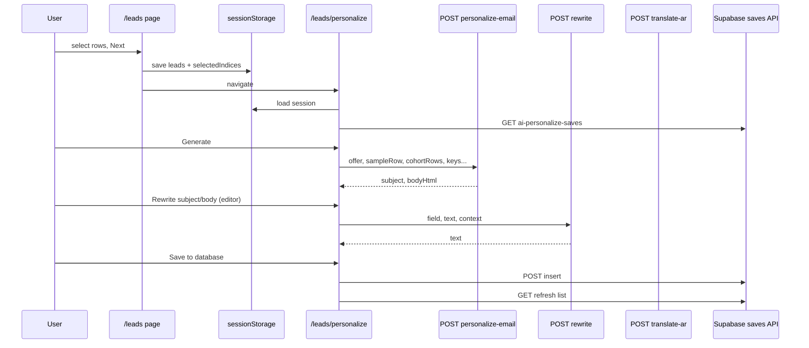

# AI personalize workflow — pipeline reference

This document describes the **Workflow → AI personalize** experience: the `/leads` selection step, the `/leads/personalize` page, how data moves through the app, and where each piece of code lives.

**Token / cost optimization** (trimmed prompts, `maxOutputTokens`, single cohort generation): see [`ai-token-optimization.md`](./ai-token-optimization.md).

**Repository root** (paths below are relative to the repo, e.g. `moxsend-phase1/`).

---

## Simple version (what the user does)

1. **Get leads into the session**  
   From the main import page or database flow, lead rows are stored in **browser session storage** together with optional import metadata (`jobId`, `fileName`).

2. **Open `/leads`**  
   Pick filters if needed, **check the rows** you want to email, then click **Next — AI personalize**.  
   That writes the full lead list plus **`selectedIndices`** (positions in the array) to session storage and navigates to personalize.

3. **Open `/leads/personalize`**  
   - **Top:** See every **selected** recipient; click one to set the **reference** contact (tone + preview).  
   - **Configure:** Offer, email length, which **merge fields** to require, optional extra instructions, optional **A/B**.  
   - **Generate:** The app calls the generation API **once per Generate click** (reference lead + optional cohort list) and fills **subject + HTML body** with placeholders like `{{name}}`; the same template is applied to every selected recipient in the UI.  
   - **Edit:** Template tools + **email editor** (HTML, preview, plain text); optional **rewrite subject**, **rewrite body**, **translate to Arabic**.  
   - **Save:** Optionally **Save to database** → Supabase table `ai_personalize_generations`.  
   - **History:** **Saved templates** at the bottom (search + filters); loaded from the same API that reads Supabase.

**Core idea:** You generate **one template** for the whole cohort; **merge tags** are filled **per recipient** when you send (or in the preview for the reference lead).

---

## In depth — data and runtime boundaries

### Session storage (client only)

| Item | Role |
|------|------|
| **Key** | `easyhawk-leads-workflow` (constant `LEADS_SESSION_KEY`) |
| **Payload** | `jobId`, `fileName`, `leads[]`, `selectedIndices[]`, `savedAt` |

**Files:**

- `frontend/lib/lead-types.ts` — `RowResult`, `LeadsSessionPayload`, `LEADS_SESSION_KEY`
- `frontend/lib/leads-session.ts` — `saveLeadsSession`, `loadLeadsSession`, `clearLeadsSession`

Nothing server-side reads this key; it is **per-tab** `sessionStorage`. If the user opens personalize without a session, the page redirects home or back to `/leads`.

### Merge tags (shared concept)

Placeholders in subject/body: `{{name}}`, `{{company}}`, `{{industry}}`, `{{region}}`, `{{city}}`, `{{role}}`, `{{website}}`.

**File:** `frontend/lib/merge-tags.ts`

- **`rowToMergeValues`** — maps a `RowResult` to those strings (`region` ← `country`, `role` ← `designation`, `website` ← `companyurl`).
- **`applyMergeTags`** — replaces tokens in a string for one row (used in the editor **Preview** tab).
- **`MERGE_TAG_KEYS`** — canonical list the UI and APIs use.

### Where generation runs

This workflow uses **Next.js Route Handlers** under `frontend/app/api/groq/` (not proxied to Express; see `frontend/next.config.ts` rewrites).

**Shared client:** `ai/model/index.ts`

- `generateText` / `generateJson` — Groq primary with automatic Gemini fallback.
  - Primary: Groq Chat Completions (`GROQ_API_KEY`, optional `GROQ_MODEL`, default `llama-3.3-70b-versatile`)
  - Backup: Gemini (`GEMINI_API_KEY`, optional `GEMINI_MODEL`, default `gemini-2.5-flash`)

---

## Generation pipeline — leads → parameters → model → response

Primary generation for this flow is in **`frontend/app/api/groq/personalize-email/route.ts`** (re-exports `frontend/app/api/gemini/personalize-email/route.ts`: `validateBody`, then `getPrompts().buildPersonalizeEmailPrompt(...)`, then `generateJsonWithMeta` with **length-based `maxOutputTokens`**). The client is **`frontend/app/leads/personalize/page.tsx`** (`onGenerate`).

### 1) How leads are selected (before the model runs)

| Step | What happens |
|------|----------------|
| Session | `leads[]` is the full import/DB list. **`selectedIndices`** are integer positions into that array (0-based), deduped and sorted when personalize loads. |
| Cohort | **`selectedLeads`** = `selectedIndices.map(i => leads[i])` — these are the only people in the run. |
| Reference row | User picks one card in **Selected recipients** → **`referenceLeadIndex`** → **`sampleRow`** (same as `sampleLead` in code) = `selectedLeads[referenceLeadIndex]`. This row drives **“Primary reference contact”** in the prompt (resolved via `rowToMergeValues`). |
| Cohort in prompt | If **`selectedLeads.length > 1`**, the client sends **`cohortRows: selectedLeads`**. If only one lead, **`cohortRows` is omitted** (API does not add a multi-recipient block). Max **200** rows validated server-side. |

**Files:** `frontend/app/leads/page.tsx` (checkboxes → `selectedIndices`), `frontend/app/leads/personalize/page.tsx` (maps indices → `selectedLeads`, `sampleRow`, `runGenerate`), `frontend/app/leads/components/SelectedRecipientsBar.tsx` (UI for reference).

### 2) What the user enters (UI) → JSON body to `POST /api/groq/personalize-email`

The browser sends **one POST per Generate action** (variant `A` in the current UI). The body is built in **`onGenerate`**:

| UI / state (personalize page) | JSON field | Required | Notes |
|--------------------------------|------------|----------|--------|
| “What are we offering?” textarea | **`offer`** | Yes | Trimmed string; rejected if empty. |
| Short / Medium / Long | **`length`** | Yes | **`short`** \| **`medium`** \| **`long`**. |
| “Personalize with” toggles | **`personalizeKeys`** | Yes | Non-empty array of keys from `MERGE_TAG_KEYS` (`name`, `company`, `industry`, `region`, `city`, `role`, `website`). Invalid keys dropped server-side; if none left → 400. |
| “Extra instructions” | **`extraInstructions`** | No | String; appended to prompt as *Additional instructions from the user*. |
| Reference lead | **`sampleRow`** | Yes | Full **`RowResult`** for the **reference** card (`selectedLeads[referenceLeadIndex]`); **`email`** must be non-empty. One template is generated for the cohort. |
| All selected (if 2+) | **`cohortRows`** | No | **`RowResult[]`**; each row must have **`email`**. |
| A vs B | **`variantLabel`** | Yes | **`"A"`** or **`"B"`** — changes **variant note** in `buildPrompt` only (same offer/length/keys otherwise). |

**Default personalize keys on first load** (personalize page): `name`, `company`, `industry`, `role` (user can change in UI).

### 3) How the server builds the prompt

**File:** `frontend/app/api/groq/personalize-email/route.ts`

1. **`validateBody`** — enforces the rules above; builds internal **`Body`**.
2. **`rowToMergeValues(sampleRow)`** (`frontend/lib/merge-tags.ts`) produces resolved strings for: name, company, industry, role, city, region (= country), website (= companyurl).
3. **`audienceLines`** — multi-line block labeled *Primary reference contact* in the prompt.
4. **`cohortBlock`** — only if `cohortRows && cohortRows.length > 1`: numbered lines from **`cohortSummaryLines`** (name, company, industry, city/region per row).
5. **`lengthGuidance(length)`** — short paragraph-count hints (see `ai/prompts/personalize-email.prompt.ts`; prompt text is kept compact for token efficiency).
6. **`tagList`** — user’s allowed merge tags only, e.g. `{{name}}, {{company}}, …` — model is told **only** those `{{...}}` tokens may appear.
7. **`variantNote`** — **A:** default hook/CTA style; **B:** different angle, avoid same opening pattern as A.
8. **Closing rules** — output **only** JSON with keys **`subject`** and **`bodyHtml`**; HTML fragment rules (no full document wrapper); tone line about buzzwords.

The exact string template now lives in **`ai/prompts/personalize-email.prompt.ts`** (`buildPersonalizeEmailPrompt`), and the route calls it through **`ai/model/prompts/promptRegistry.ts`**.

### 3.1) Prompt plugin model (how to swap prompts without changing route logic)

This flow uses a **registry pattern** so prompts are not hardcoded in handlers:

1. **Default prompt builders** live in dedicated prompt modules:
   - `ai/prompts/personalize-email.prompt.ts`
   - `ai/prompts/rewrite.prompt.ts`
   - `ai/prompts/translate-ar.prompt.ts`
2. **Registry** (`ai/model/prompts/promptRegistry.ts`) exposes:
   - `getPrompts()` — used by routes at runtime
   - `registerPrompts(overrides)` — plug in alternate builders
   - `resetPrompts()` — restore defaults
3. **Routes stay stable** and only do validation + orchestration, then call:
   - `getPrompts().buildPersonalizeEmailPrompt(...)`
   - `getPrompts().buildRewritePrompt(...)`
   - `getPrompts().buildTranslateArPrompt(...)`

Practical effect: you can ship different prompt packs (tone/version/experiment/tenant) by registering new builder functions that keep the same input/output contract, without editing route handlers.

### 4) Calling the model and parsing the result

**File:** `ai/model/index.ts`

- **`generateJsonWithMeta<GeminiOut>(prompt, { maxOutputTokens })`** is used for personalize-email (caps completion tokens by **short / medium / long**).
- Expected shape: **`{ subject: string, bodyHtml: string }`** (parsed loosely; code fences stripped if present).

**Route handler after the model returns** (`personalize-email/route.ts`):

- Trims `subject` and `bodyHtml`.
- If either is empty → **502** *Model returned empty subject or body*.
- Success → **`{ ok: true, subject, bodyHtml }`**.

### 5) What the frontend does with the response

**File:** `frontend/app/leads/personalize/page.tsx`

- Response **subject/body** are stored for **every** selected lead (same template).
- **Translate to Arabic:** if all rows share the same English, **one** `translate-ar` call is used; otherwise one call per row.
- **rewrite** uses `/api/groq/rewrite` with tight **`maxOutputTokens`** for subject vs body.

### 6) Where to change behavior

| Goal | Where to change |
|------|------------------|
| System persona, offer section, merge-tag rules, JSON output contract | **`buildPersonalizeEmailPrompt`** in `ai/prompts/personalize-email.prompt.ts` (or register an override in `ai/model/prompts/promptRegistry.ts`) |
| Paragraph length behavior for Short/Medium/Long | **`lengthGuidance`** in `personalize-email.prompt.ts` |
| How cohort list is summarized for multi-lead runs | **`cohortSummaryLines`** (and/or cohort paragraph in `buildPersonalizeEmailPrompt`) |
| Variant A vs B behavior | **`variantNote`** logic in `buildPersonalizeEmailPrompt` |
| Validation (what the client may send) | **`validateBody`** in `frontend/app/api/gemini/personalize-email/route.ts` |
| Model identity, temperature, JSON mode, **max output tokens** | **`generateJson`** / **`generateJsonWithMeta`** / **`generateText`** in `ai/model/index.ts` + route-level options; env `GROQ_MODEL` / `GEMINI_MODEL`. See **`docs/ai-token-optimization.md`**. |

**Product constraint:** The UI assumes **one merge-tag template** per generation for the cohort. The client performs **one** personalize-email request per Generate click (reference row + cohort summary), not one model call per lead.

---

## Page-by-page file map

### 1) Lead selection — `/leads`

**File:** `frontend/app/leads/page.tsx`

- On mount: `loadLeadsSession()`; if missing leads → redirect `/`; if no selected indices → redirect `/leads` from personalize only (personalize page enforces that).
- Renders **filters + table**; tracks `selectedIndices` as a `Set` of indices into the **original** `leads` array (stable even when the table is filtered/paginated).
- **Persist:** `useEffect` calls `saveLeadsSession` when selection or leads change.
- **Next — AI personalize:** `saveLeadsSession` with sorted `selectedIndices`, then `router.push('/leads/personalize')`.

**Supporting UI:**

- `frontend/app/leads/components/FilterBar.tsx` — search, dropdown filters, sort, page select-all.
- `frontend/app/leads/components/LeadsDataTable.tsx` — rows for current page; checkbox calls `onToggleRow(originalIndex)`.

### 2) Personalize — `/leads/personalize`

**File:** `frontend/app/leads/personalize/page.tsx`

- Loads session, normalizes **`selectedIndices`** (unique, sorted), builds **`selectedLeads`** = `indices.map(i => allLeads[i])`.
- **State:** offer, length, personalize keys, extra instructions, A/B flag, generated A/B subject+body, editor variant, campaign title, save messages, **saved list** from GET `/api/ai-personalize-saves`.
- **`runGenerate`:** `POST /api/gemini/personalize-email` with `sampleRow` = reference lead, optional `cohortRows` when more than one selected; updates local subject/body state.
- **`runSave`:** `POST /api/ai-personalize-saves` with template + metadata; then refreshes saves.

**Child components:**

| File | Purpose |
|------|---------|
| `frontend/app/leads/components/SelectedRecipientsBar.tsx` | Lists selected leads; choose **reference** row. |
| `frontend/app/leads/components/AiPersonalizeCard.tsx` | Offer, length, merge toggles, extra instructions, A/B toggle, generate/regenerate/save, inline output preview. |
| `frontend/app/leads/components/TemplateToolsBar.tsx` | Mock templates from `frontend/lib/mock-templates.ts`; apply full template or insert HTML snippet into editor. |
| `frontend/app/leads/components/EmailEditorPanel.tsx` | Campaign title, subject, body (HTML / preview / plain); mock subject by tone (`mock-subject-by-tone`); **Rewrite subject/body** → `/api/gemini/rewrite`; **Translate to Arabic** → `/api/gemini/translate-ar`. |
| `frontend/app/leads/components/SavedPersonalizationsPanel.tsx` | History list; client-side **search** + **cohort size** + **created date** filters; data from GET saves API. |

### 3) Entry points that fill the session (not on `/leads` itself)

**File:** `frontend/app/page.tsx`

- **`goToLeads`** — after CSV job results: saves `jobId`, `fileName`, `leads` (no indices; `/leads` then defaults selection to successful rows or all).
- **`goToLeadsFromDatabase`** — saves `leads` + explicit `selectedIndices` from DB picker.

---

## API routes (generation)

### `POST /api/groq/personalize-email`

**File:** `frontend/app/api/groq/personalize-email/route.ts`

- **Input (JSON):** `offer`, `length` (`short` \| `medium` \| `long`), `personalizeKeys`, `extraInstructions`, `sampleRow`, `variantLabel` (`A` \| `B`), optional `cohortRows` (max 200).
- **Behavior:** Builds a **single prompt** (compact B2B rules, offer, reference contact, optional cohort summary, length, allowed `{{...}}`, variant A/B). Calls **`generateJsonWithMeta`** with **`maxOutputTokens`** by length. Expects `{ subject, bodyHtml }`.
- **Output:** `{ ok, subject, bodyHtml }` or error.

**Related type:** `frontend/lib/email-personalize-types.ts` — `EmailLength`.

### `POST /api/groq/rewrite`

**File:** `frontend/app/api/groq/rewrite/route.ts`

- **Input:** `field`: `subject` \| `body`, `text`, optional `campaignTitle`, `audienceSummary`, `offerContext`.
- **Behavior:** Separate prompts; subject rewrites use **short max tokens** and **post-processing** so only a plain subject line is returned (no accidental HTML body).

### `POST /api/groq/translate-ar`

**File:** `frontend/app/api/groq/translate-ar/route.ts`

- Translates current variant’s subject + HTML body to Arabic (used from `EmailEditorPanel`).

### `GET` / `POST /api/ai-personalize-saves`

**File:** `frontend/app/api/ai-personalize-saves/route.ts`

- **GET:** Reads Supabase table **`ai_personalize_generations`**, newest first, limit 80. If Supabase is not configured, returns `configured: false`, `items: []`.
- **POST:** Inserts one row (reference lead, cohort count, offer, settings, subject/body A and optional B).

**Supabase wiring:** `frontend/lib/supabase-admin.ts` — service role client from env (`SUPABASE_URL` / `NEXT_PUBLIC_SUPABASE_URL`, `SUPABASE_SERVICE_ROLE_KEY`).

### HTTP helpers

**File:** `frontend/lib/fetch-json.ts` — `fetchJson`, `postJson` (browser calls relative `/api/...` on the Next origin).

---

## End-to-end sequence (diagram)

---

## Environment variables (quick checklist)

| Variable | Used for |
|----------|----------|
| `GROQ_API_KEY` | Primary model (Groq) |
| `GROQ_MODEL` | Optional; defaults in `ai/model/groq.ts` |
| `GEMINI_API_KEY` | Backup model (Gemini) |
| `GEMINI_MODEL` | Optional; defaults in `ai/model/gemini.ts` |
| `SUPABASE_URL` or `NEXT_PUBLIC_SUPABASE_URL` | Saves + history |
| `SUPABASE_SERVICE_ROLE_KEY` | Server-side insert/select (admin client) |

Typically set in **repo root** `.env.local` (Next loads via `frontend/next.config.ts` `loadEnvConfig` on the monorepo root — the parent of `frontend/`).

---

## Summary table — “what file does what?”

| Path | Responsibility |
|------|----------------|
| `frontend/app/leads/page.tsx` | Select leads; persist session; go to personalize |
| `frontend/app/leads/personalize/page.tsx` | Orchestrate personalize UI, generate, save, refresh history |
| `frontend/app/leads/components/SelectedRecipientsBar.tsx` | Cohort list + reference row selection |
| `frontend/app/leads/components/AiPersonalizeCard.tsx` | Brief + generate + save controls + template preview |
| `frontend/app/leads/components/EmailEditorPanel.tsx` | Edit HTML; preview merge tags; rewrite; translate |
| `frontend/app/leads/components/TemplateToolsBar.tsx` | Apply mock templates / snippets |
| `frontend/app/leads/components/SavedPersonalizationsPanel.tsx` | Saved runs + search/filters |
| `frontend/app/leads/components/FilterBar.tsx` | Lead list filters (selection page) |
| `frontend/app/leads/components/LeadsDataTable.tsx` | Lead table + checkboxes |
| `frontend/lib/leads-session.ts` | Session persistence |
| `frontend/lib/lead-types.ts` | `RowResult`, session payload types |
| `frontend/lib/merge-tags.ts` | Merge tokens and row mapping |
| `ai/model/index.ts` | Model routing: Groq primary, Gemini fallback |
| `frontend/lib/fetch-json.ts` | Typed fetch for `/api` |
| `frontend/lib/supabase-admin.ts` | Supabase admin client |
| `frontend/app/api/groq/personalize-email/route.ts` | Main cohort email generation step |
| `frontend/app/api/groq/rewrite/route.ts` | Rewrite subject or body |
| `frontend/app/api/groq/translate-ar/route.ts` | Arabic translation |
| `frontend/app/api/ai-personalize-saves/route.ts` | Persist + list generations |
| `frontend/app/page.tsx` | Populate session from import / DB |
| `frontend/next.config.ts` | Env load; CSV/job rewrites; App Router serves `/api/gemini/*` |

---

Update this doc when routes or env layout under `frontend/` changes.
